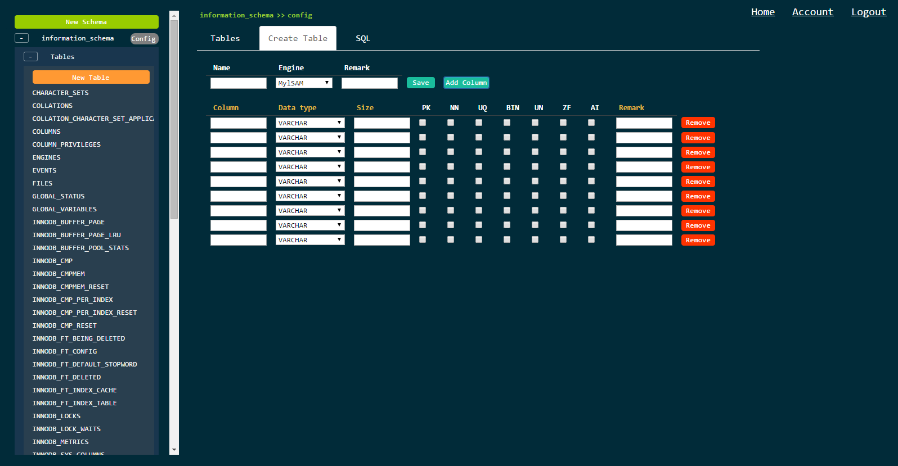
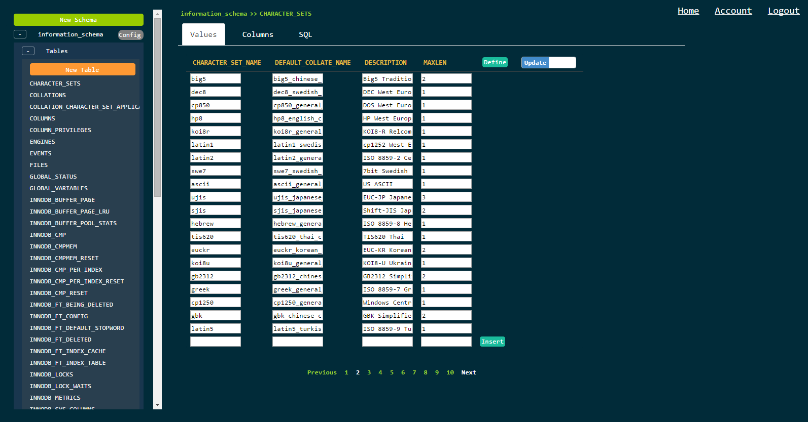

DBMS Client
====
A database management tool over the web.

How to compile this project?
----
mvn package

Demo
----

Database Type
----
+ MySQL
+ SQLServer(To Do)
+ Oracle(To Do)

License:
----
[GPLv3](http://opensource.org/licenses/GPL-3.0)
